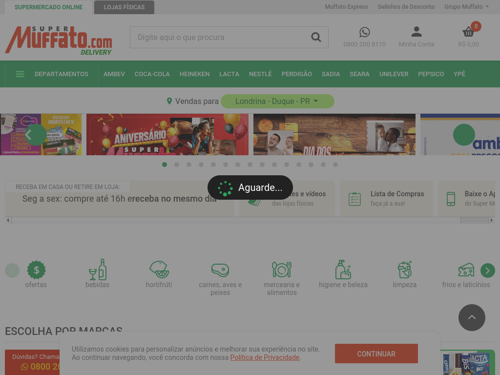

<!--
  $$\   $$\ $$$$$$$$\  $$$$$$\   $$$$$$\   $$$$$$\
  $$ |  $$ |$$  _____|$$  __$$\ $$  __$$\ $$  __$$\
  $$ |  $$ |$$ |      $$ /  \__|$$ /  \__|$$ /  \__|
  $$ |  $$ |$$$$$\    \$$$$$$\  \$$$$$$\  $$ |
  $$ |  $$ |$$  __|    \____$$\  \____$$\ $$ |
  $$ |  $$ |$$ |      $$\   $$ |$$\   $$ |$$ |  $$\
  \$$$$$$  |$$$$$$$$\ \$$$$$$  |\$$$$$$  |\$$$$$$  |
  \______/ \________| \______/  \______/  \______/
      All rights reserved. Refer to LICENSE.md.
  --------------------------------------------------
    Author: Lucas Alvarenga (lb.am.alvarenga@uel.br)
    Name: doc/template.txt
    Date: 2023-08-08
    Desc: Template header for project files
-->

# UESSC

| <!-- -->                  | <!-- -->                                       |
| ------------------------- | ---------------------------------------------- |
|  | UEL and Econostat Scraping Software Collection |

## Requisites

- [Python3.8+](https://www.python.org/downloads/)
- [Docker with docker-compose](https://docs.docker.com/desktop/)

## Quickstart

On Linux:

```bash
python -m venv env
source env/bin/activate
python -m pip install -r requirements.txt

docker-compose up -d
python src/main.py
```

On Windows:

```powershell
python -m venv env
.\env\Scripts\activate
python -m pip install -r requirements.txt

docker-compose up -d
python src\main.py
```



## Project Navigation

- doc &rarr; Documentation
- src &rarr; Source Code
- src/spiders &rarr; Scripts that crawl websites with [scrapy](https://scrapy.org/)
- src/splash &rarr; Scripts that use [splash](https://github.com/scrapinghub/splash) to perform complex interactions with websites

## Contributing

Utilize [Conventional Commits](https://www.conventionalcommits.org/en/v1.0.0/) whenever possible.

## Links

- https://docs.scrapy.org/en/latest/intro/tutorial.html
- https://github.com/scrapy-plugins/scrapy-splash
- https://splash.readthedocs.io/en/stable/scripting-tutorial.html
